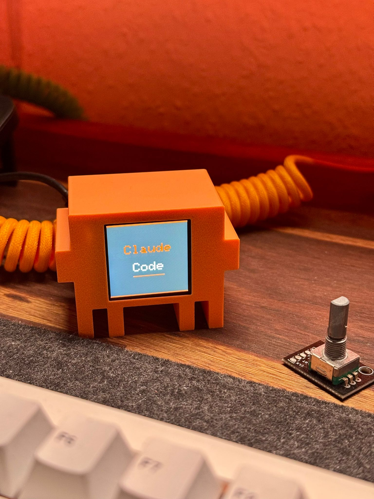
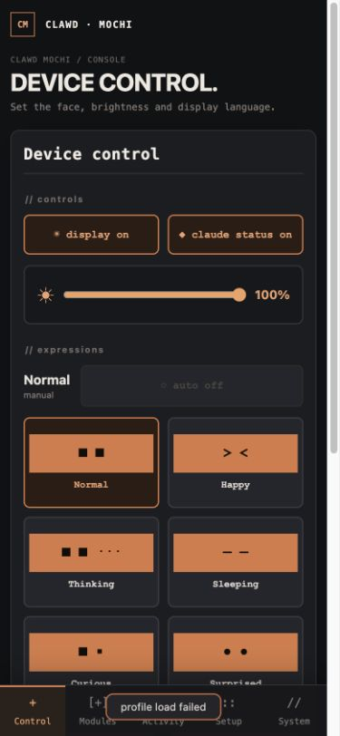
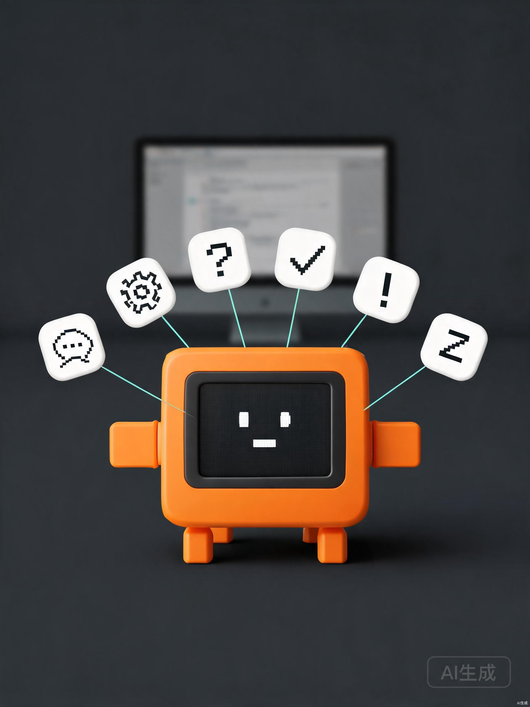
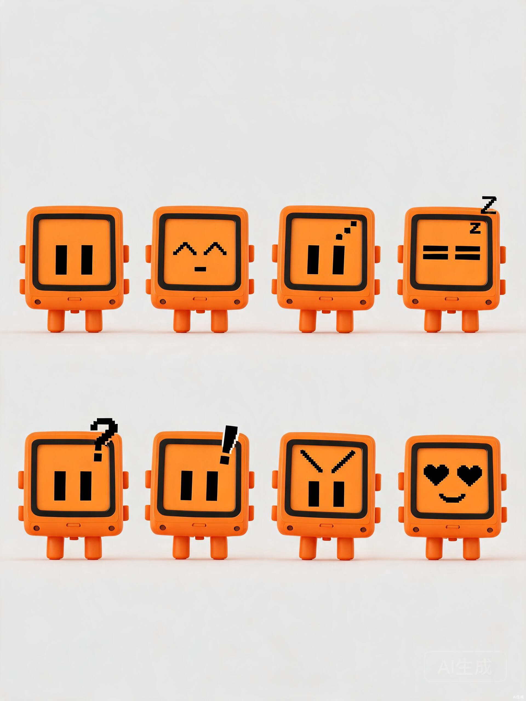
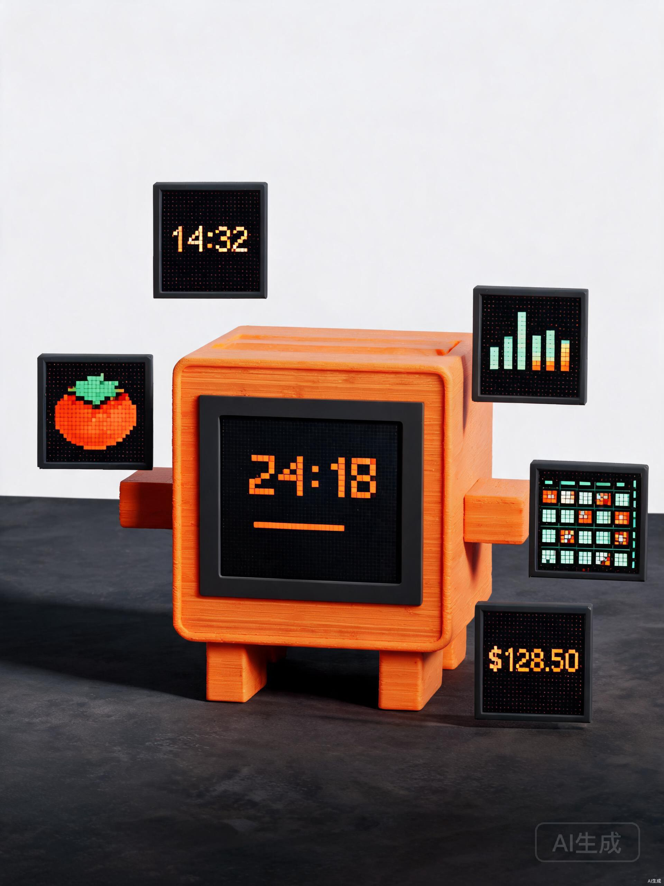
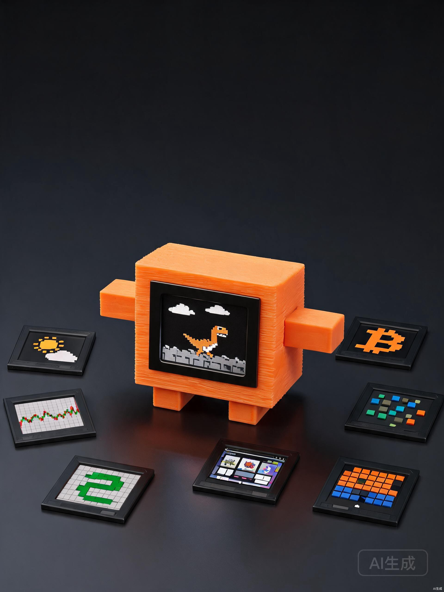

<!-- LOGO -->
<p align="center">
  
</p>

# Clawd Mochi

Clawd Mochi 是一个运行在 ESP32-C3 上的桌面陪伴设备：它用 1.54 英寸 240×240 ST7789 彩色屏幕显示像素表情、Claude Code 工作状态、时间、天气和各种信息，也可以通过手机浏览器或桌面控制台进行局域网控制。

这是一个独立的 Claude Code 粉丝项目，不依赖云端账号；设备本身可以建立 WiFi 热点，控制链路主要在本地网络内完成。

<p align="center">
  
  
</p>

> This is an independent fan project. It is not affiliated with, sponsored by, or endorsed by Anthropic. “Claude” and “Clawd” are trademarks of Anthropic.

## 项目做了哪些改进

这个仓库已经从最初 fork 的单文件 Arduino 示例，发展成了一个可长期运行、可扩展的 PlatformIO 固件项目。主要改进包括：

- **固件架构重写**：从单一 `.ino` 文件升级为分层架构，包含状态机、硬件抽象、服务层和独立 View 层。
- **完整的本地控制面板**：设备内置 Web 控制器，覆盖表情、亮度、主题、字体、启动页面、轮播、媒体、课程表、OTA 和游戏等设置。
- **Claude Code 深度联动**：通过 UDP Hook 接收会话、Prompt、工具调用、权限请求、完成和错误等事件，在屏幕上显示状态、工具、模型和耗时，并同步切换表情。
- **Claude 用量监控**：设备本身查询 5 小时与 7 天用量窗口，在屏幕、手机控制器和桌面控制台显示已用比例、剩余比例和重置倒计时；电脑不需要常驻参与查询。
- **从简单天气扩展为信息终端**：增加时钟、番茄钟、天气、加密货币、股票行情、Live Ledger 工时收入、课程表等信息视图。
- **媒体与投屏**：支持图片/GIF 播放，也支持桌面端通过 TCP 将 PC 屏幕推送到 Mochi 的 240×240 屏幕。
- **街机游戏模块**：加入 Dino、Sokoban、Tetris、Snake、2048 和 Breakout 六款游戏，并针对 ESP32-C3 的内存限制使用懒加载和分段渲染。
- **桌面控制台**：增加基于 Electron + React 的 macOS/Windows 上位机，提供设备发现、桌面采集、裁切模式、JPEG 编码、预览、推流、托盘和自动重连。
- **可靠性与可维护性**：加入 NVS 偏好设置、LittleFS 数据存储、WiFi 配网、日志、网络请求并发门控、OTA 校验/回滚和 Web UI 回归测试。

## 功能总览

### 设备显示

- 8 种表情：Normal、Happy、Thinking、Sleeping、Curious、Surprised、Grumpy、Love
- 自动眨眼、视线和表情动画
- Claude Code 状态页面：`IDLE`、`THINKING`、`WORKING`、`PERMISSION`、`DONE`、`ERROR`、`SLEEPING` 等
- 时钟与日期、番茄钟
- 天气：IP 定位、浏览器 GPS、城市搜索，数据来自 Open-Meteo
- 加密货币行情：CoinLore，最多配置 5 个资产
- 股票行情：腾讯行情接口，最多配置 5 个标的
- Live Ledger：工作期间实时累计收入，可配置工作时间与时薪
- 课程表：LittleFS JSON 数据，支持 WakeUp、XiaoAi、ICS 和导出文件导入
- 待机轮播：可配置页面顺序、速度、固定页面和夜间调暗
- Claude 用量：设备独立请求，显示 5 小时/7 天窗口的已用和剩余额度，并支持凭证保存、清除和手动刷新

### 交互与媒体

- 手机/电脑浏览器 Web 控制器，支持本地 AP 或局域网访问
- 触摸画布：从浏览器实时绘图到屏幕
- 图片、GIF 上传与播放
- PC 桌面无线投屏：鼠标跟随裁切、全屏缩放、固定区域三种模式
- 6 款街机游戏：Dino、Sokoban、Tetris、Snake、2048、Breakout
- 主题：orange-black、orange-white、dark-orange、mint、pink
- 亮度、动画速度、启动页面和显示开关控制

### Claude Code 联动

Hook 会把 Claude Code 的事件广播到局域网内已发现的 Mochi 设备：

```text
Claude Code Hook -> UDP discovery/status -> ESP32-C3 -> TFT expression + status panel
```

安装 Hook：

```bash
scripts/hooks/install_claude_hook.sh
```

### Claude 用量监控

从手机浏览器控制器的 `Usage` 页面，或 Mochi Desktop 的 `Claude Usage` 页面写入凭证。设备会把凭证保存到 NVS，并通过 WiFi 定时向 Anthropic 请求用量；浏览器和桌面端只负责配置和查看状态。

凭证写入接口位于设备的局域网 Web 服务，当前控制器没有登录认证，也没有 HTTPS，因此请只在可信的局域网或设备配网热点内操作。凭证不会通过状态接口返回；清除凭证后，设备会停止额度请求。

卸载：

```bash
scripts/hooks/install_claude_hook.sh uninstall
```

Hook 使用 UDP 4210 发送状态，设备发现使用 UDP 4211。当前实现默认走局域网，不通过 USB 串口发送事件。

## 演示截图

### Web 控制器

设备启动后，手机连接 `ClaWD-Mochi` 热点或与设备处于同一局域网，然后访问 `http://192.168.4.1` 或设备 IP：

<p align="center">
  
</p>

截图来自仓库中的实际 `data/controller.html` 页面，按约 375×812 的手机视口截取。没有连接实体设备时，状态读取和保存相关请求不会成功，但页面布局与控制器资源可以独立预览。

### 设备与显示效果

<p align="center">
  
  
</p>

<p align="center">
  
  
</p>

## 硬件

| 部件 | 规格 |
| --- | --- |
| 主控 | ESP32-C3 Super Mini |
| 屏幕 | 1.54 英寸 ST7789，240×240，SPI |
| 供电 | USB-C，屏幕使用 3.3V |
| 外壳 | PLA/PETG 3D 打印外壳 |

| 屏幕引脚 | ESP32-C3 |
| --- | --- |
| VCC | 3V3 |
| GND | GND |
| SDA / MOSI | GPIO 10 |
| SCL / SCK | GPIO 8 |
| RES | GPIO 2 |
| DC | GPIO 1 |
| CS | GPIO 4 |
| BL | GPIO 3 |

> 请务必将屏幕 VCC 接到 3.3V，不要接 5V。BOOT 按键使用 GPIO9，长按约 5 秒执行恢复出厂设置。

更多接线资料：[`docs/wiring/wiring_diagram.png`](docs/wiring/wiring_diagram.png)、[`docs/wiring/wiring_photo.png`](docs/wiring/wiring_photo.png)。

## 快速开始

项目使用 PlatformIO + Arduino framework。相比早期 README 中的 Arduino IDE 流程，现在推荐直接使用 PlatformIO 构建固件和上传 LittleFS Web 资源。

### 构建固件

```bash
pio run
```

### 上传固件与 Web 资源

```bash
pio run --target upload
pio run --target uploadfs
```

### 串口监视器

```bash
pio device monitor
```

首次启动时设备会进入配网流程。默认 AP 配置为：

```text
SSID:     ClaWD-Mochi
Password: clawd1234
Address:  http://192.168.4.1
```

设备也提供 mDNS 名称 `clawd-mochi.local`；在局域网环境中可直接尝试访问它。

## 桌面控制台

`desktop_app/` 是 PC 端 MochiDesktop，适用于 macOS 和 Windows。当前可用重点是桌面投屏：

- UDP 4211 自动发现设备，也支持手动输入 IP
- 鼠标跟随裁切、全屏缩放、固定区域三种采集模式
- FPS 3–15、JPEG 质量 30–90、多显示器选择
- 240×240 本地预览、TCP 3333 推流、断线指数退避重连、系统托盘

```bash
cd desktop_app
npm install
npm run dev
```

桌面帧在局域网内明文传输，发现与控制消息也未认证，请只在可信的私有网络中使用投屏功能。

## 代码结构

```text
src/
  hardware/   屏幕等硬件抽象
  service/    WiFi、Web、Claude Code、天气、行情、OTA 等服务
  states/     应用状态机
  view/       表情、信息页面和街机游戏
data/         LittleFS Web 控制器与前端资源
desktop_app/  Electron + React 桌面控制台
scripts/
  hooks/      Claude Code Hook 与安装脚本
  device/     设备辅助脚本
  testing/    单元、Web UI 与 OTA 测试
docs/         接线、UI 概念和项目资料
```

ESP32-C3 的 RAM 是硬约束。游戏、媒体和桌面投屏模块都按需加载，退出时立即释放；全彩游戏使用 16 行 strip buffer，避免分配 240×240 的完整 RGB565 帧缓冲。

## 测试

```bash
uv run --with pytest scripts/testing/test_suite.py unit
uv run scripts/testing/test_suite.py web
```

修改嵌入式 Web 控制器后，建议运行 Web UI 回归测试；修改固件后至少运行 `pio run`。OTA 测试需要真实 ESP32、可达的主机 IP 和串口设备，详见 `scripts/testing/ota_test.py`。

## 3D 外壳

电子外壳模型位于 [`models/clawd_mochi/`](models/clawd_mochi/)，也可以从 [MakerWorld](https://makerworld.com/en/models/2559505-clawd-mochi-physical-claude-code-mascot#profileId-2820000) 下载。

建议打印参数：PLA/PETG、层高 0.15–0.20 mm、15% gyroid 填充、显示窗悬空处使用支撑。

## 贡献与许可

欢迎添加新表情、显示页面、数据源、游戏和桌面控制功能。新增设备控制能力时，请同时维护 Web 控制器与桌面控制台的功能一致性。

固件与代码使用 MIT License，详见 [`LICENSE`](LICENSE)。3D 模型和媒体资源使用 CC BY-NC-SA 4.0。

---

Support the project on Instagram: [@clawd.mochi](https://instagram.com/clawd.mochi)
