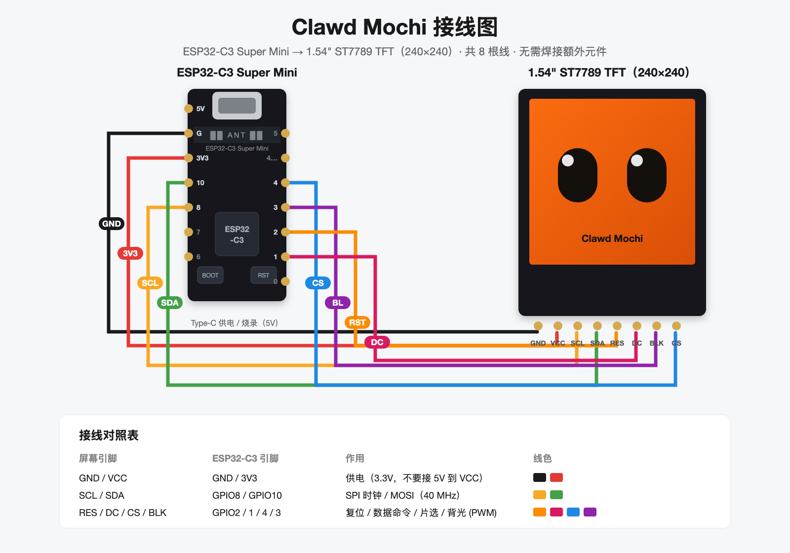

# Clawd Mochi 制作教程（从开箱到点亮）

一个会眨眼、能显示 Claude Code 状态的桌面小宠物。ESP32-C3 + 1.54 寸圆角 TFT，WiFi 局域网控制，不依赖任何云服务。

配套接线图：

---

## 第 0 步：准备物料

见 [BOM.md](BOM.md)。核心就 4 样：ESP32-C3 Super Mini、1.54" ST7789 屏（8 针 3.3V）、8 根母对母杜邦线、Type-C 数据线。

## 第 1 步：接线（8 根线）

| 屏幕引脚 | → | ESP32-C3 引脚 | 说明 |
|---------|---|--------------|------|
| GND | → | G | 地 |
| VCC | → | 3V3 | 3.3V 供电（**不要接 5V**） |
| SCL | → | GPIO8 | SPI 时钟 |
| SDA | → | GPIO10 | SPI MOSI |
| RES | → | GPIO2 | 复位 |
| DC  | → | GPIO1 | 数据/命令 |
| CS  | → | GPIO4 | 片选 |
| BLK | → | GPIO3 | 背光（PWM 调光） |

> 建议按接线图里的颜色用线，后面排查问题一目了然。

## 第 2 步：装开发环境

```bash
# 安装 PlatformIO（VSCode 插件或命令行任选其一）
pip install platformio        # 命令行方式
```

## 第 3 步：烧录固件

```bash
git clone <本仓库地址>
cd clawd_mochi

pio run                        # 编译
pio run --target upload        # 烧录固件（插上 Type-C）
pio run --target uploadfs      # 烧录 Web 控制台页面（LittleFS）
pio device monitor             # 可选：看串口日志
```

## 第 4 步：配网

1. 上电后屏幕会进入配网模式，同时设备放出热点 **`ClaWD-Mochi`**（密码 `clawd1234`）。
2. 手机/电脑连上该热点，浏览器打开 `http://192.168.4.1`，在 WiFi 设置页填入家里 2.4G WiFi 的账号密码。
3. 连接成功后屏幕显示 IP 地址；同局域网浏览器访问 `http://<设备IP>` 或 `http://clawd-mochi.local` 即可打开控制台。

## 第 5 步：玩起来

Web 控制台里可以：

- **表情**：8 种表情（普通/开心/思考/睡觉/好奇/惊讶/生气/爱心），手动或自动模式
- **信息屏**：时钟、番茄钟、天气、加密货币、A股行情、工资计数器、课表
- **投屏**：网页画板涂鸦实时同步、图片/GIF 投屏
- **小游戏**：恐龙、推箱子、俄罗斯方块、贪吃蛇、2048、打砖块
- **主题**：5 套配色 + 亮度 + 夜间自动调暗
- **OTA**：网页里直接上传新固件，带校验和失败回滚

## 第 6 步（可选）：接入 Claude Code

装一个 hook，小宠物会实时显示 Claude Code 的工作状态（思考中/写代码中/完成/报错），还会统计今日专注时长：

```bash
scripts/install_claude_hook.sh      # macOS/Linux
scripts\install_claude_hook.bat     # Windows
```

之后 Claude Code 干活时，Mochi 的眼睛会跟着动。

## 常见问题

| 现象 | 排查 |
|------|------|
| 白屏/不亮 | 先核对 8 根线顺序；BLK 必须接 GPIO3；VCC 是 3V3 不是 5V |
| 搜不到 `ClaWD-Mochi` 热点 | 长按 BOOT 键 5 秒恢复出厂后重新上电 |
| 连不上家里 WiFi | 只支持 2.4GHz；密码里有特殊字符注意转义 |
| `uploadfs` 失败 | 先正常 upload 一次固件再传文件系统 |
| 串口找不到 | 换一根带数据功能的 Type-C 线 |

## 长按 BOOT 键 5 秒 = 恢复出厂设置

忘掉它也能救回来，放心折腾。
